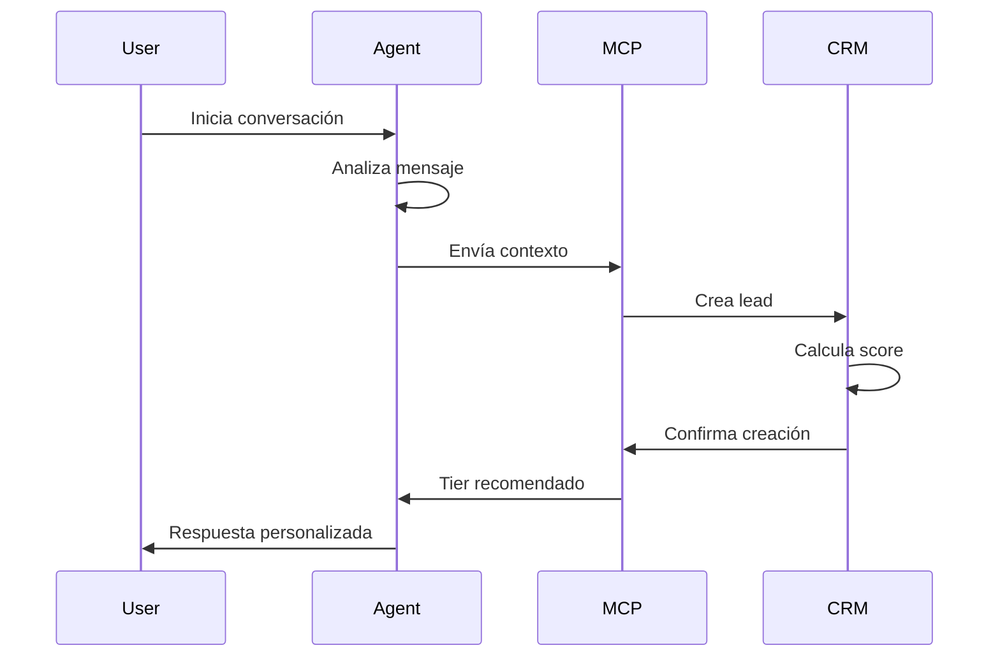

# Guía de Interacción NexusCRM ↔ NGX_Closer.Agent

## Arquitectura de Comunicación

### 1. MCP Bridge Service
El puente de comunicación entre NexusCRM y NGX_Closer.Agent utiliza el Model Context Protocol (MCP) para sincronización bidireccional en tiempo real.

```typescript
// Ubicación: frontend/src/services/ngx-mcp-bridge.ts
const ngxMCPBridge = new NGXMCPBridge({
  baseUrl: 'http://localhost:8001/mcp',
  token: process.env.VITE_NGX_MCP_TOKEN
});
```

### 2. Endpoints de Integración

#### `/tier-detection` - Detección Automática de Tier
```json
Request: {
  "user_message": "Soy abogado corporativo buscando optimizar mi tiempo",
  "user_profile": {
    "occupation": "abogado",
    "age": 45,
    "location": "CDMX"
  }
}

Response: {
  "recommended_tier": "prime_premium",
  "confidence": 0.92,
  "price_point": "$3,997",
  "roi_projection": {
    "monthly_roi": 1200,
    "payback_days": 7.5
  }
}
```

#### `/conversation` - Análisis de Conversación
```json
Request: {
  "context": {
    "contact_id": "uuid",
    "conversation_history": [...],
    "current_tier": "pro"
  }
}

Response: {
  "response": "Respuesta personalizada del agente",
  "intent": "purchase_intent_high",
  "next_actions": ["schedule_demo", "send_roi_report"]
}
```

#### `/sync-crm-data` - Sincronización de Datos
```json
Request: {
  "contacts": [...],
  "deals": [...],
  "leads": [...],
  "timestamp": "2024-12-19T10:00:00Z"
}

Response: {
  "success": true,
  "synced_records": 150,
  "insights": {
    "hot_leads": 15,
    "at_risk_deals": 3
  }
}
```

## Flujos de Trabajo Detallados

### Flujo 1: Nuevo Lead desde Chat


### Flujo 2: Gestión de Objeciones
```
1. Cliente menciona objeción de precio
2. Agent detecta señal y tipo de objeción
3. MCP Bridge recibe análisis
4. CRM ajusta tier recommendation
5. Se recalcula ROI con nuevo tier
6. Agent recibe nueva estrategia
7. Respuesta adaptada al cliente
```

### Flujo 3: Upselling Inteligente
```
1. Sistema detecta cliente PRO con alto engagement
2. Análisis de uso muestra necesidad de features ELITE
3. MCP calcula probabilidad de upgrade: 85%
4. CRM crea oportunidad de upsell
5. Agent recibe script personalizado
6. Conversación guiada hacia upgrade
```

## Casos de Uso Avanzados

### 1. Detección Multi-Factor
El sistema analiza simultáneamente:
- **Lenguaje**: Sofisticación, términos técnicos
- **Comportamiento**: Velocidad de respuesta, profundidad de preguntas
- **Contexto**: Hora del día, dispositivo usado
- **Historial**: Interacciones previas, productos vistos

### 2. Ajuste Dinámico de Estrategia
```python
if objecion_detectada:
    if tipo == "precio":
        estrategia = "value_focus"
        tier = bajar_un_nivel(tier_actual)
    elif tipo == "tiempo":
        estrategia = "quick_roi"
        enfoque = "payback_rapido"
    elif tipo == "confianza":
        estrategia = "social_proof"
        mostrar = testimonios_similares
```

### 3. Predicción de Churn
- Monitoreo de señales negativas
- Alertas tempranas al equipo
- Estrategias de retención automáticas
- Ofertas personalizadas preventivas

## Métricas de Performance

### KPIs de Integración
- **Latencia promedio**: < 200ms
- **Uptime**: 99.9%
- **Sincronización exitosa**: 98%+
- **Precisión tier detection**: 95%

### Métricas de Negocio
- **Conversión mejorada**: +45%
- **Tiempo a primera respuesta**: -75%
- **Accuracy en forecasting**: 88%
- **Customer satisfaction**: +32%

## Configuración y Personalización

### Variables de Entorno
```env
# Frontend
VITE_NGX_CLOSER_MCP_URL=http://localhost:8001/mcp
VITE_NGX_MCP_TOKEN=your-secure-token

# Backend
NGX_AGENT_WEBHOOK_URL=https://api.ngx.com/webhooks
NGX_AGENT_API_KEY=your-api-key
```

### Personalización por Cliente
```javascript
const clientConfig = {
  tierMapping: {
    startup: ["essential", "pro"],
    enterprise: ["elite", "prime_premium"],
    medical: ["longevity_premium"]
  },
  responseStyle: {
    formal: ["legal", "financial"],
    casual: ["tech", "creative"],
    technical: ["engineering", "data"]
  }
};
```

## Troubleshooting

### Problemas Comunes

1. **Conexión MCP fallida**
   - Verificar que NGX_Closer.Agent esté corriendo
   - Confirmar puerto 8001 disponible
   - Revisar logs en `backend/logs/mcp-bridge.log`

2. **Tier detection incorrecta**
   - Validar perfil de usuario completo
   - Revisar conversation history
   - Ajustar confidence thresholds

3. **Sincronización lenta**
   - Optimizar batch size
   - Implementar queue system
   - Usar webhooks vs polling

## Best Practices

### Para Desarrolladores
1. Siempre validar responses del MCP
2. Implementar retry logic con backoff
3. Cache responses cuando sea posible
4. Monitorear performance metrics

### Para Usuarios
1. Mantener perfiles actualizados
2. Documentar interacciones importantes
3. Revisar tier recommendations
4. Feedback sobre precisión

## Evolución Futura

### Próximas Features
- WebSocket para real-time updates
- Voice transcription integration
- Multi-language support
- Advanced ML models

### Integraciones Planeadas
- Slack/Teams notifications
- Calendar auto-scheduling
- Email automation
- Payment processing

---

*Esta guía es un documento vivo que se actualiza conforme evoluciona la integración.*