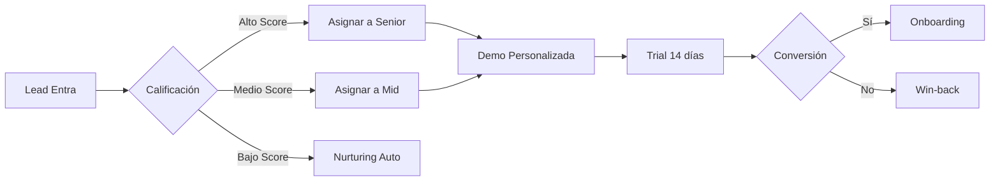

# 📋 Plan de Implementación NexusCRM 2025
## Sistema Integral CRM + IA para NGX

---

## 🎯 Objetivo General
Implementar NexusCRM en producción con todas las integraciones (GENESIS, NGX_Closer.Agent, Claude Desktop) funcionando al 100% para revolucionar las operaciones comerciales de NGX.

---

## 📅 FASE 1: Pre-Producción (Semana 1-2)
**Objetivo**: Preparar el entorno y migrar datos reales

### ✅ Checklist Técnico

#### 1.1 Configuración de Infraestructura
- [ ] **Supabase Producción**
  - [ ] Crear proyecto en Supabase para producción
  - [ ] Obtener credenciales (URL y Service Role Key)
  - [ ] Configurar Row Level Security (RLS)
  - [ ] Habilitar autenticación con email/password
  - [ ] Configurar backups automáticos diarios

- [ ] **Variables de Entorno**
  ```bash
  # backend/.env
  SUPABASE_URL=your_production_url
  SUPABASE_SERVICE_ROLE_KEY=your_production_key
  GENESIS_WEBHOOK_SECRET=generate_secure_secret_here
  NEXUS_CRM_BASE_URL=https://crm.ngx.com
  
  # GENESIS-NGX-AGENTS/backend/.env
  CRM_BASE_URL=https://crm.ngx.com
  CRM_WEBHOOK_SECRET=same_secure_secret_here
  CRM_INTEGRATION_ENABLED=true
  ```

- [ ] **Dominio y SSL**
  - [ ] Configurar subdominio crm.ngx.com
  - [ ] Certificado SSL (Let's Encrypt)
  - [ ] Configurar CORS para dominios NGX

#### 1.2 Migración de Base de Datos
- [ ] **Ejecutar Schemas**
  ```sql
  -- En Supabase SQL Editor
  1. database/schema.sql
  2. database/agent_usage_schema.sql
  3. database/migrations/001_initial_setup.sql
  ```

- [ ] **Migrar Datos Existentes**
  - [ ] Exportar contactos actuales a CSV
  - [ ] Script de migración con validación
  - [ ] Importar deals activos
  - [ ] Migrar histórico de interacciones

#### 1.3 Deployment
- [ ] **Backend Deployment (Railway/Render/Vercel)**
  - [ ] Deploy NexusCRM backend
  - [ ] Deploy GENESIS backend con integración CRM
  - [ ] Verificar endpoints y health checks
  - [ ] Configurar monitoring (Datadog/New Relic)

- [ ] **Frontend Deployment (Vercel/Netlify)**
  - [ ] Build optimizado de producción
  - [ ] Variables de entorno de producción
  - [ ] CDN configuration
  - [ ] Error tracking (Sentry)

#### 1.4 Testing Pre-Producción
- [ ] **Tests de Integración**
  ```bash
  python3 test_system.py --env=production
  python3 test_mcp_integration.py
  ```
- [ ] **Verificar Webhooks**
  - [ ] GENESIS → NexusCRM flow
  - [ ] Alertas funcionando
  - [ ] WebSocket dashboard

---

## 🚀 FASE 2: Onboarding y Training (Semana 3)
**Objetivo**: Capacitar al equipo NGX en el uso del sistema

### 👥 Plan de Capacitación

#### 2.1 Sesión 1: CRM Básico (2 horas)
- **Audiencia**: Todo el equipo comercial
- **Contenido**:
  - Navegación por el dashboard
  - Crear y gestionar contactos
  - Pipeline management (Kanban)
  - Crear deals y moverlos
  - Sistema de tareas
  - Reportes básicos

#### 2.2 Sesión 2: Comandos IA (2 horas)
- **Audiencia**: Power users y managers
- **Contenido**:
  - Introducción a Claude Desktop
  - Comandos básicos:
    ```
    "Claude, crea un contacto para John Smith de TechCorp"
    "¿Cómo está nuestro pipeline?"
    "Genera el reporte diario"
    ```
  - Comandos avanzados:
    ```
    "Analiza el churn risk del último mes"
    "¿Qué clientes están listos para upgrade?"
    "Inicia secuencia de upsell para cliente_123"
    ```

#### 2.3 Sesión 3: Analytics Avanzado (1 hora)
- **Audiencia**: Leadership team
- **Contenido**:
  - Dashboard de agent usage
  - Interpretar alertas
  - Métricas de predicción
  - ROI tracking
  - Decisiones basadas en datos

### 📚 Materiales de Training
- [ ] Video tutoriales (5-10 min cada uno)
- [ ] Guía de referencia rápida (PDF)
- [ ] Cheat sheet de comandos IA
- [ ] Casos de uso específicos NGX
- [ ] FAQ y troubleshooting

---

## 🔧 FASE 3: Optimización de Workflows (Semana 4)
**Objetivo**: Personalizar el CRM para procesos específicos NGX

### 🎯 Workflows a Implementar

#### 3.1 Trial → Customer Journey


- [ ] Automatizar asignación por score
- [ ] Templates de email por etapa
- [ ] Alertas de trial expiring
- [ ] Secuencia de onboarding

#### 3.2 Upselling Automático
- [ ] **Triggers**:
  - 85% de uso de límite → Propuesta upgrade
  - 3 meses en tier → Review de necesidades
  - Alto engagement → Ofrecer PRIME/LONGEVITY
  
- [ ] **Acciones**:
  - NGX_Closer.Agent genera propuesta
  - Schedule call automático
  - Follow-up sequence
  - Track conversion

#### 3.3 Gestión de PRIME/LONGEVITY
- [ ] Dashboard específico de programas
- [ ] Tracking de sesiones 1:1
- [ ] Entrega de bonuses
- [ ] Alertas de milestones
- [ ] Renovación automática

### 🤖 Comandos Personalizados NGX
```bash
# Operaciones diarias
"Claude, ¿quién necesita follow-up hoy?"
"Programa demos para todos los leads calientes"
"¿Cuál es el status de los trials activos?"

# Analytics específico
"¿Cómo va la conversión de PRIME este mes?"
"Muéstrame el uso de NEXUS vs BLAZE"
"¿Qué clientes Elite son candidatos para PRIME?"

# Automatizaciones
"Inicia onboarding para [cliente]"
"Activa campaña de reactivación para inactivos"
"Genera propuestas de renewal para Q2"
```

---

## 📊 FASE 4: Monitoreo y Optimización (Mes 2+)
**Objetivo**: Asegurar adopción y optimizar basado en uso real

### 📈 KPIs a Monitorear

#### 4.1 Métricas de Adopción
- [ ] % del equipo usando el CRM diariamente
- [ ] Comandos IA ejecutados por semana
- [ ] Datos ingresados vs automáticos
- [ ] Tiempo en sistema por usuario

#### 4.2 Métricas de Negocio
- [ ] Velocidad del pipeline (antes vs después)
- [ ] Conversion rate por etapa
- [ ] Tiempo promedio de cierre
- [ ] Revenue per lead
- [ ] Churn rate reduction
- [ ] Upsell success rate

#### 4.3 Métricas de IA
- [ ] Precisión de predicciones
- [ ] Alertas útiles vs ruido
- [ ] Conversiones de auto-upsell
- [ ] Ahorro de tiempo por automatización

### 🔄 Ciclo de Mejora Continua
1. **Weekly Review** (30 min)
   - Revisar alertas de la semana
   - Identificar bottlenecks
   - Ajustar automations

2. **Monthly Deep Dive** (2 horas)
   - Análisis de KPIs
   - Feedback del equipo
   - Nuevas automatizaciones
   - Ajuste de modelos IA

3. **Quarterly Planning**
   - Roadmap de features
   - Integraciones adicionales
   - Expansión a nuevos equipos

---

## 🚨 Gestión de Riesgos

### Riesgos Identificados y Mitigación

| Riesgo | Probabilidad | Impacto | Mitigación |
|--------|--------------|---------|------------|
| Resistencia al cambio | Media | Alto | Training intensivo + Quick wins |
| Problemas técnicos | Baja | Alto | Staging environment + Rollback plan |
| Data quality issues | Media | Medio | Validación + Limpieza previa |
| Sobrecarga de alertas | Alta | Bajo | Fine-tuning de thresholds |
| Integración GENESIS | Baja | Alto | Testing exhaustivo + Monitoring |

### 🛡️ Plan de Contingencia
- [ ] Backup manual de procesos críticos
- [ ] Hotline de soporte primera semana
- [ ] Rollback procedure documentado
- [ ] Cache de datos offline
- [ ] Plan B para cada automatización

---

## 💰 ROI Proyectado y Métricas de Éxito

### Mes 1
- ✅ Sistema 100% operacional
- ✅ 80% adopción del equipo
- ✅ Primeras automatizaciones activas

### Mes 3
- 📈 +20% velocidad en pipeline
- 📈 +15% conversion rate
- 📈 -50% tiempo en reportes
- 📈 Primeros upsells automáticos exitosos

### Mes 6
- 💰 +40% en upgrades
- 💰 -25% churn rate
- 💰 +30% revenue per user
- 💰 ROI positivo demostrado

### Año 1
- 🚀 2,240% ROI total
- 🚀 Expansión a nuevos mercados
- 🚀 Platform as competitive advantage
- 🚀 Case study de innovación B2B

---

## 📞 Puntos de Contacto y Soporte

### Durante Implementación
- **Project Manager**: [Nombre] - Coordinación general
- **Tech Lead**: [Nombre] - Problemas técnicos
- **Training Lead**: [Nombre] - Capacitación
- **IA Specialist**: Claude Desktop support

### Post-Implementación
- **Slack Channel**: #nexuscrm-support
- **Email**: crm-support@ngx.com
- **Office Hours**: Martes y Jueves 3-4pm
- **Documentation**: crm.ngx.com/docs

---

## ✅ Checklist Final Pre-Launch

### Semana antes del Go-Live
- [ ] Todos los usuarios tienen acceso
- [ ] Datos migrados y verificados
- [ ] Integraciones tested end-to-end
- [ ] Backups configurados
- [ ] Monitoring activo
- [ ] Equipo capacitado
- [ ] Documentación actualizada
- [ ] Plan de comunicación listo

### Día del Go-Live
- [ ] 8:00 AM - Final system check
- [ ] 9:00 AM - Go live announcement
- [ ] 9:30 AM - Primera sesión Q&A
- [ ] Todo el día - Soporte on-site
- [ ] 5:00 PM - Review del día
- [ ] 6:00 PM - Celebración 🎉

---

## 🎯 Definición de Éxito

El proyecto será considerado exitoso cuando:

1. **Adopción**: 90%+ del equipo usa el CRM diariamente
2. **Automatización**: 70%+ de tareas repetitivas automatizadas
3. **Satisfacción**: NPS > 8 del equipo NGX
4. **ROI**: Mejoras medibles en KPIs de negocio
5. **Innovación**: NGX reconocido como líder en CRM+IA

---

## 🚀 Visión a Futuro

### Q2 2025
- Integración con WhatsApp Business
- Mobile app con voice commands
- Expansión a equipo de marketing

### Q3 2025
- ML models personalizados por industria
- API pública para partners
- Marketplace de integraciones

### Q4 2025
- Expansión internacional
- White-label offering
- NGX CRM as a Service

---

*"El futuro de la gestión comercial B2B empieza aquí. Let's revolutionize how NGX does business!"* 🚀

---

**Documento preparado por**: Claude AI Assistant  
**Fecha**: Enero 2025  
**Versión**: 1.0  
**Próxima revisión**: Post-implementación Fase 1